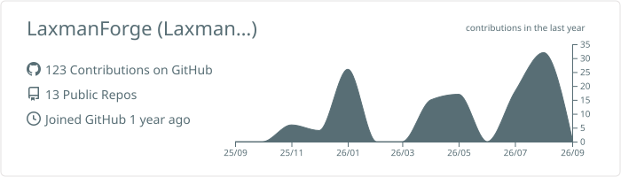
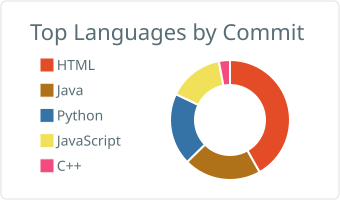
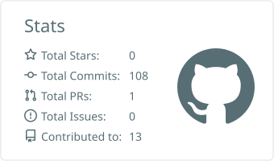

  
  

  

    
    
  

 

<h3 align="center">🛠️ Arsenals & Cloud Tech</h3>

  

 

<h3 align="center">📊 Activity Dashboard</h3>

  
  

 

  

 

<h3 align="center">🐍 Contribution History</h3>

  

